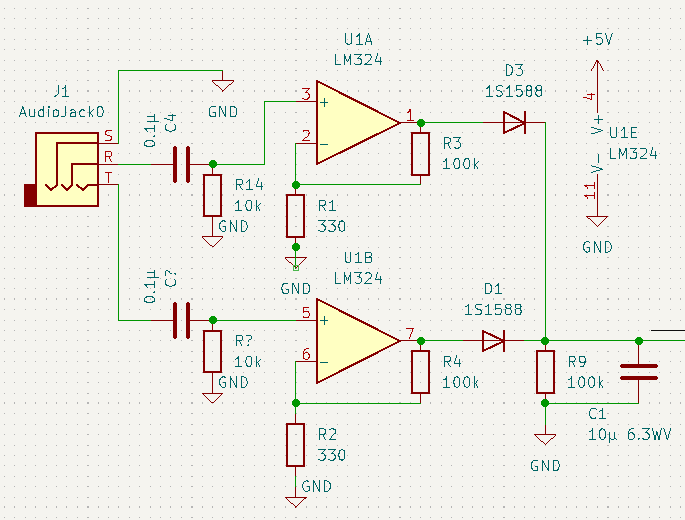
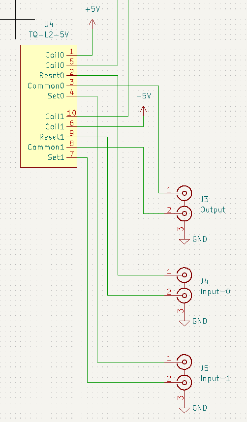
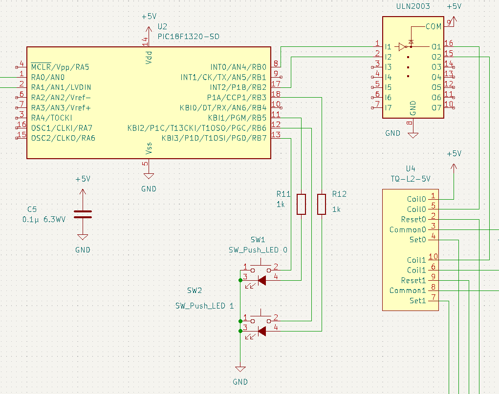

# Audio switcher

## 概要

HDMI切り替え機の多くは、自動切り替え機能を持っており、複数の入力機器の中からonになった機器に自動で切り替えてくれます。オーディオでも同じようなことができれば、いちいち手で切り替えなくて良いので楽になりますね。

## 仕組み

オーディオ信号は交流なので整流して直流にし、そのレベルを見て切り替えれば良さそうです。ただオーディオ信号そのものを拝借すると音質への影響も懸念されます。そこでヘッドホン出力を使うことにしました。割と多くの機器にはRCAのオーディオ出力と一緒にヘッドホン出力が付いています。このヘッドホン出力の方を信号検出に使うわけです。

## 各部の設計

### 信号検出

アンプで増幅して整流します。昔ならトランジスタを使うところでしょうが、今はOpアンプが安いのでOpアンプで済ませます(LM324は4回路入りで30円)。

オーソドックスな非反転増幅回路で、入力の直流成分をカットするためにコンデンサを入れています。100kΩと330Ωなので300倍もの増幅率になり、わずかな入力があれば振り切ってしまいますが、今回は入力があるかないかの0/1検出なのでこれでOk。出力は10μFのコンデンサにして整流したものをこのコンデンサに蓄えます。100kΩの負荷である程度の時間で電荷を放電させます。

### 信号スイッチ

信号劣化を最小限にするためにリレーを使用。普通のリレーだとMake側にするためにはコイルに電流を流しっぱなしにする必要があり、信号への影響が懸念されるのでラッチリレーを使用しました。ラッチリレーは中に永久磁石が入っていて、スイッチを切り替えたい時にだけコイルに電流を流すだけで良いため、信号への影響を最低限にできるでしょう。

### 制御回路

全体の制御はPICというマイクロコントローラを使用。今回は手元の部品箱で眠っていた18F1320を使用しました。スペック的には余裕があり使用メモリも1/4くらいしか使っていないので、以下の機能を持った16Fシリーズのもので十分でもしょう。

### A/D変換

信号研修で整流した直流電位をA/D変換で測定するため、A/D変換チャネルが2つ必要です。

### 手動切り替え

手動切り替えもできるようにLED内蔵の押しボタンスイッチを付けました。このために入力2ポートと出力2ポートが必要です。

### 信号切り替え

信号スイッチのリレーを駆動するための出力2ポートが必要です。またPICの出力電流では直接リレーの駆動はできないのでドライバが必要です。ここもトランジスタを使うのも面倒なのでTBD62003APGというドライバアレイを使いました。2chあれば十分なところ7chも入っていますが、50円なので良いでしょう。このドライバは入力のラッチアップ保護抵抗や、リレーの逆起電力保護のダイオードまで内蔵されているので、この手の用途では楽できます。

### デバッグ用通信

これはオプションですが、デバッグ用に通信機能があった方が楽です。UARTがあった方が良いでしょう。今回はこれを115200bpsに設定してPCにデバッグ情報を送るのに使っています。デバッグ情報としてはA/D変換の結果を定期的に送っています。A/D変換器は10bitなので0から1023の値が2セット送信されてきます。

### その他

今回は精度もいらないので内蔵のCR発振器で8MHzをシステムクロックとしました。大して速度もいらないのでもっと遅いクロックでも良いのですが、電池駆動でもないのでこれで良いでしょう。

### 制御プログラム

今回の用途ならリアルタイム応答性能は不要なので、面倒な割込は使わずポーリングだけで実装しました。[制御プログラム](https://github.com/ruimo/audioswitcher/tree/main/firmware)は手動入力切り替え、A/D変換、UART制御のそれぞれにステートマシンを作って、ぐるぐる回しているだけです。UARTの送信バッファ用に[簡単なリングバッファ](https://github.com/ruimo/audioswitcher/blob/main/firmware/ringbuffer.c)を実装しました。あとはなるべく単体テストができるように[デバイス制御の部分](https://github.com/ruimo/audioswitcher/blob/main/firmware/device.c)だけを外に出してあります。

### 自動テスト

デバイス制御の部分を切り出してあるので、PC側でGoogleTestを使って自動テストしています。各ステートマシンの挙動の確認、リングバッファの動作の確認をしています。テストコードのビルドにはcmakeを使用しました([CMakeLists.txtはこちら](https://github.com/ruimo/audioswitcher/blob/main/CMakeLists.txt))。

## ソースコード

全体のソースコードはこちら。

[Source Repository](https://github.com/ruimo/audioswitcher)

